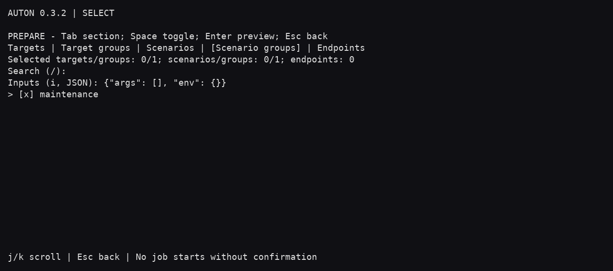
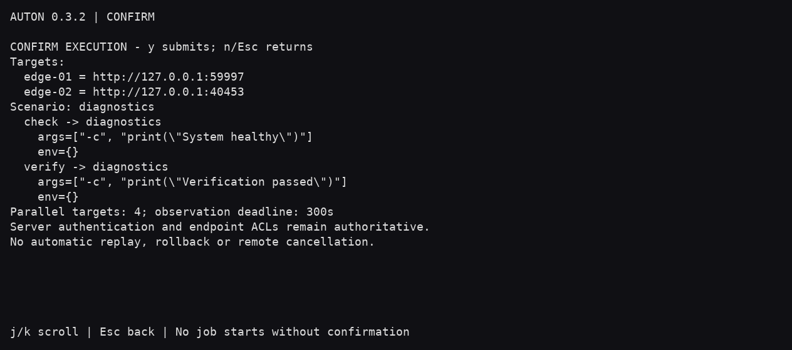
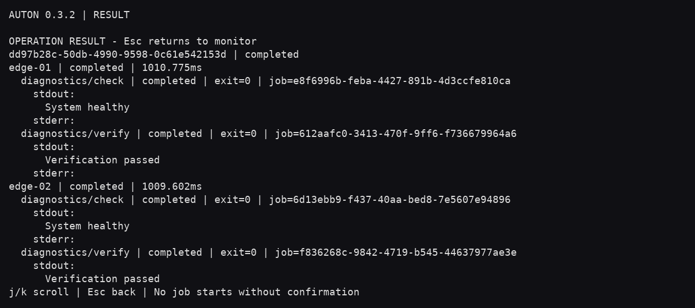
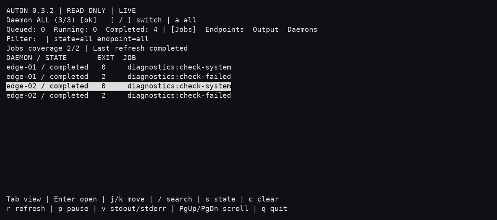
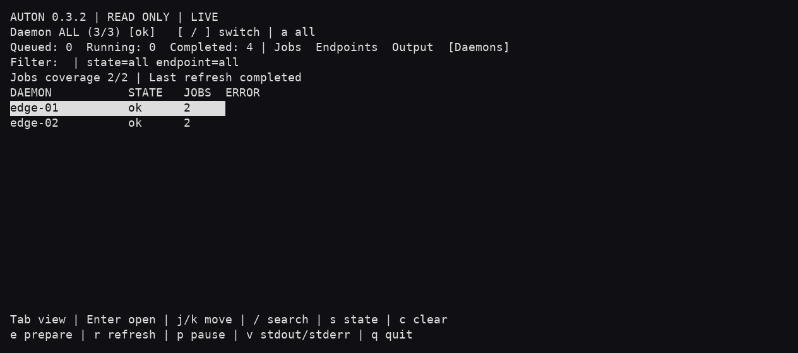
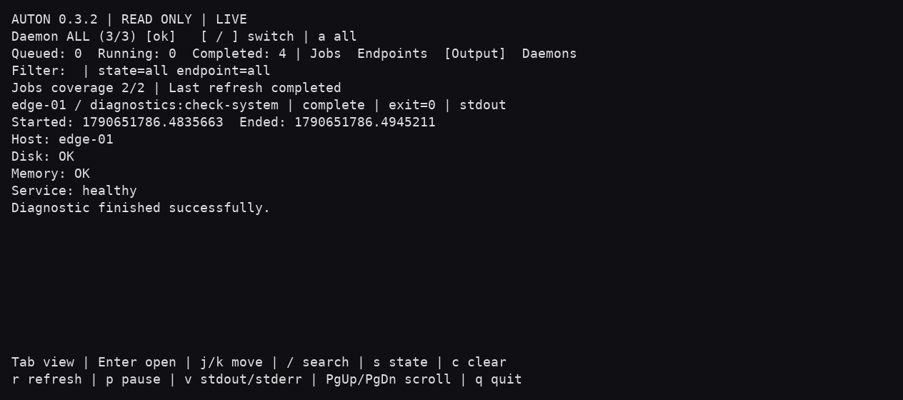
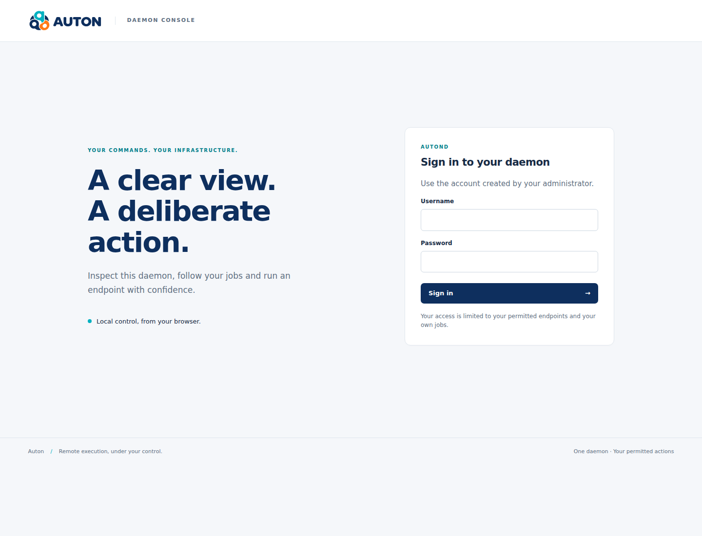
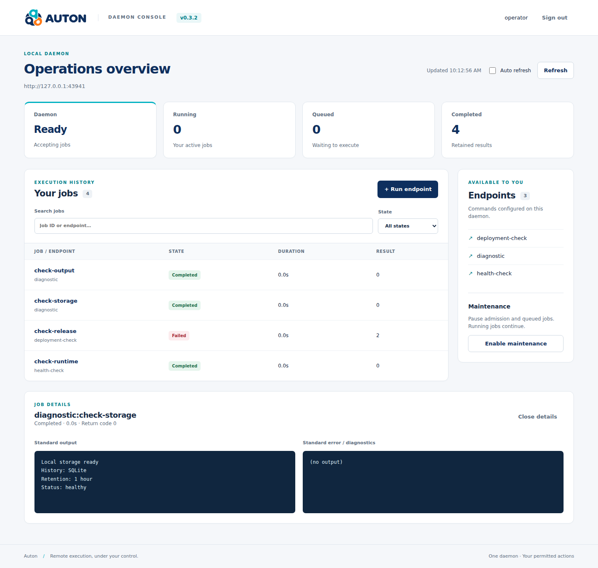
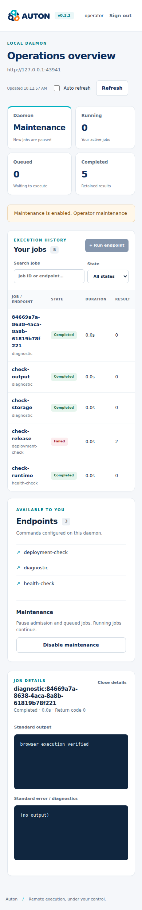

<p align="center">
  <picture>
    <source media="(prefers-color-scheme: dark)" srcset="assets/brand/svg/logo-horizontal-dark.svg">
    
  </picture>
</p>

## auton project

[](https://pypi.org/project/auton/)
[](https://pypi.org/project/auton/)
[](https://github.com/decryptus/auton/actions/workflows/dockerhub.yml)
[](https://auton.readthedocs.io/)

Auton is a free, open-source remote-execution product. **auton** is the CLI/TUI
client; **autond** exposes configured commands through an authenticated HTTP API
and an optional local web console. Use it for operator diagnostics, CI/CD tasks
and remote tools such as Ansible, curl or Terraform.

The client selects targets and orchestrates scenarios. Each daemon enforces its
own endpoint permissions, executes jobs and retains their results. No central
server is required.

## Roadmap

See [ROADMAP.md](ROADMAP.md) for the current Auton product roadmap, including the TUI, multi-autond support, multi-target execution and dedicated website.

## Quickstart

This quickstart uses the **development checkout**, including SQLite authentication,
durable jobs and the web console. These features are not in the published 0.3.2
packages yet. Run the following from the repository root with Docker Compose:

```sh
docker compose build
docker compose run --rm --no-deps --entrypoint autond-auth auton \
  -c /etc/auton/auton.yml user set -u operator -s read -s run -s maintenance
docker compose up -d
```

Choose a password at the interactive prompt, then open
[http://127.0.0.1:8666/ui/](http://127.0.0.1:8666/ui/) and sign in as `operator`.
Select the `hello` endpoint and confirm execution: its fixed command prints
`Hello from Auton!`. There are no default credentials.

[Compose](docker-compose.yml) binds the published port to host loopback; the
[container configuration](etc/auton/docker.yml.example) listens on the container
interface. Authentication and job history use separate SQLite files in a named
volume. `docker compose down` preserves them; **`docker compose down -v` deletes
them**. Results still expire according to the configured retention policy.

For remote access, configure HTTPS, set `web_origin` to the external origin and
keep the backend private (see [the web console](#autond-web-console)).
The supplied browser origin deliberately accepts `127.0.0.1`, not `localhost`.

## Runtime and reliability notes

This branch targets Linux/Unix with Python **3.10–3.12**. Python 2 support is
removed. Python 3.13+ is not supported yet because the daemon still imports
`crypt`. Python 3.12 installs the `pyasyncore` compatibility dependency.

The Docker image now installs **this checkout**, runs as the `auton` user, and
Compose publishes port 8666 on **127.0.0.1 only**. The quickstart uses required
SQLite authentication and endpoint permissions. Existing Basic configurations
remain supported; use HTTPS before exposing either authentication mode remotely.
The handler keeps each authenticated identity local to its request.

### Execution and failover

* The first successful server accepts the job; the client stops trying other
  servers. Automatic failover is limited to failures to establish a connection.
  A read timeout or disconnect after sending a request is ambiguous and **does
  not cause another POST**. Use `--mode status --uid <original-id>` to inspect it.
  There is no shared state or cross-server exactly-once guarantee.
* `--http-timeout 30` bounds each HTTP connection/read wait. It is distinct from
  the endpoint's execution `timeout` and is not a total job deadline.
* On execution timeout, the process group is terminated and reaped; the client
  receives exit code 124. Shutdown interrupts the active command with code 130.
  Jobs must remain in their process group; this is not a container sandbox.
* stdout/stderr are decoded as UTF-8, replacing invalid sequences. Partial lines
  are available without waiting for a newline. The initial response is displayed.
* Client arguments are literal, including braces and JSON. Only administrator
  configured arguments support variable interpolation. Uploaded names must be
  plain basenames; absolute paths and traversal are rejected.

### Results and resource limits

New clients send `X-Auton-Output-Offset` on status requests and consume the
`next_offset` from responses. Offsets count output chunks, not bytes. Repeating
an offset returns the same prefix plus any output subsequently produced, without
consuming another reader's output. Legacy clients retain their shared cursor.
A completed job is no longer deleted on the first status request.

Limits in `general`:

| Setting | Default | Behavior |
| --- | --- | --- |
| `result_ttl` | 3600 seconds | Completed results expire; cleanup occurs on subsequent run/status requests. |
| `max_jobs` | 128 | Caps queued, running and retained jobs together. Oldest completed results are evicted first; if all jobs are active, new submissions receive 503. |
| `max_output_bytes` | 1048576 | Combined UTF-8 stdout/stderr budget per job. Exceeding it stops the command with exit code 1. A short diagnostic is retained in addition. |

By default, results are in memory and lost on restart. Optional SQLite storage
preserves retained results; the Docker quickstart enables it. IDs are reserved only while their
job is retained; use a fresh UUID for each operation. Once evicted or expired,
results cannot be replayed and IDs no longer protect against repeat execution.
Status access is restricted to the submitting authenticated user and the current
endpoint permissions. Unauthenticated demo jobs have no individual user identity.

### Local daemon visibility

The daemon also exposes these read-only routes:

| Request | Result |
| --- | --- |
| `GET /jobs` | `jobs`: metadata for the caller's retained jobs, without output. |
| `GET /jobs?endpoint=test&status=complete` | Exact endpoint/state filters. States are `new`, `processing`, `complete`; completion does not imply exit code zero. Invalid filters return 400. |
| `GET /jobs/<endpoint>/<id>` | Metadata and retained output; `X-Auton-Output-Offset` selects stdout chunks, defaulting to zero. |
| `GET /endpoints` | `endpoints`: names allowed by the current endpoint ACLs. |
| `GET /health` | `status: ok` when the local job service can be accessed; not a check of remote dependencies or worker progress. |
| `GET /stats` | `stats`: visible job count, counts by state, and accessible endpoint count. |

Lists, details and statistics enforce current endpoint permissions and job
ownership. Counts do not include other users' jobs; shared queue depths are not
exposed. Detail returns HTTP 200 even when the inspected command failed: inspect
`status`, `return_code` and `errors`. Missing/expired jobs return 404, access denial
returns 403, and a service lock timeout returns 503. Listing, statistics and detail
requests also clean expired results. Optional local SQLite history survives restart
(see [Durable local jobs](#durable-local-jobs)); memory remains the default.

These reads never advance the legacy `/status` output cursor. Detail uses the
existing output format (`stream` for stdout, `errors` for stderr/diagnostics).
The existing `/run` and `/status` contracts are unchanged.

The example configuration uses `auth_mode: required`: configure Basic or SQLite
credentials before starting it. Current endpoint ACLs and job ownership still
apply. Use HTTPS for remote access. Keep the existing `run` route's
`safe_init: true` setting when migrating route configuration.

### Explicit multi-target execution (development branch)

Run one command on each explicitly named daemon:

```sh
auton --target web-01=https://autond-01.example.com \
      --target web-02=https://autond-02.example.com \
      --endpoint curl --operation-id deploy-42 --parallel 2 \
      -a https://example.com
```

Targets can also be declared in an explicit **client** YAML inventory, separate
from the `autond` server configuration. See
[targets.yml.example](etc/auton-client/targets.yml.example):

```yaml
targets:
  autond-01: https://autond-01.example.com
  autond-02: https://autond-02.example.com
```

Select one or more configured targets by repeating `--target`:

```sh
auton --config targets.yml --target autond-01 --target autond-02 \
      --endpoint curl -a https://example.com
```

Configured names and ad hoc targets can be mixed:

```sh
auton --config targets.yml --target autond-01 \
      --target temporary=https://autond-03.example.com \
      --endpoint curl -a https://example.com
```

The same inventory supports read-only TUI selection:

```sh
auton --config targets.yml --tui --daemon autond-01 --daemon autond-02
```

Named groups can select several declared targets. Group and target names use
`[a-z0-9-]+` (1–32 characters); members are exact target names, not nested groups.

```yaml
targets:
  autond-01: https://autond-01.example.com
  autond-02: https://autond-02.example.com
groups:
  production: [autond-01, autond-02]
```

```sh
# Execute once on each target in the union of the selections.
auton -c targets.yml -t autond-01 -g production --endpoint curl -a https://example.com

# Open a read-only TUI restricted to the same group; no job is submitted.
auton --tui -c targets.yml -g production
```

`-c`, `-t` and `-g` are aliases for `--config`, `--target` and `--target-group`.
Repeat `-g` to combine groups. Explicit targets are resolved first, then groups
in option order and members in file order; overlapping members execute once.
Repeated direct `--target` names remain errors. Separate names pointing at the
same normalized origin are still rejected for execution. Groups never change
failover behavior. Targets and group selectors support the patterns described below; YAML group members remain exact names.

Declaring targets never selects them automatically. `--config` requires explicit
`--target`, `--target-group` or `--daemon` selections and cannot be combined with
`--uri`. There is no implicit inventory path or variable substitution. Unknown
names, duplicate YAML keys, invalid names/URIs (including unselected entries),
unknown fields and non-string URI values are rejected before any request. An
inline `NAME=URI` cannot shadow a configured name; choose another alias.

The inventory supports 1–128 targets, at most 128 groups and 1–128 members per
group. Quote numeric-only names and YAML-reserved words such as `on`.
Authentication stays in the existing CLI/environment options, not in the file.

`--target NAME` or `--target NAME=URI` can also select read-only TUI connections.
`--daemon` remains TUI-only and cannot be mixed with `--target`; either can be
combined with `--target-group`. For execution, target selections cannot use
`--uid`/`AUTON_UID`, `--mode run/status` or `--no-return-code`. `AUTON_URI` is
ignored for explicit named selections. Repeated `--uri` values remain failover.

#### Name, glob and regular-expression selection

The CLI and TUI use the same convention as monit-docker:

```sh
# Globs match the entire name, case-sensitively.
auton --tui -c targets.yml -t 'web-*' -g 'prod-*'

# A leading ~ selects a regex; matching starts at the beginning of the name.
# Add $ to require an end match. Quote patterns to avoid shell expansion.
auton --tui -c targets.yml --daemon '~web-[0-9]{1,2}$'
```

`--target`/`-t`, `--target-group`/`-g` and TUI `--daemon` accept selectors.
Repeat options to combine them; commas belong to the pattern and are never
split. Patterns only match declared names in the inventory, not URI strings.
Inline `NAME=URI` still creates an explicit ad hoc connection. Groups expand
after their names are matched; overlapping selections retain their first position
and execute once. Repeating an exact direct target name remains an error.

Every selector must match at least one name. Unknown names, invalid expressions,
regex timeouts and empty matches abort the entire selection before network or
terminal startup. There is no fallback to all targets. A selection accepts up
to 128 selectors, 4096 characters each, with a one-second total matching budget
and a maximum 50 ms per pattern/name comparison. Regex syntax follows Python
`re`, evaluated by the bounded `regex` VERSION0 matcher. Declared target/group
names still use the separate `[a-z0-9-]+` validation rule.

#### Single-level section imports

Use DWho's `import_<section>` convention in the **main client file**:

```yaml
import_targets:
  - targets/production.yml
  - targets/staging.yml
import_groups: groups.yml
```

An imported targets file contains the name-to-URI mapping directly, without a
`targets:` wrapper. An imported groups file contains the group-to-member-list
mapping directly, without a `groups:` wrapper. Inline `targets` and `groups`
sections can add other names alongside imports.

Paths are local, relative to the main file's directory (absolute local paths are
also accepted). **Only one import level is allowed**: imported files cannot import
other files. Duplicate file paths (including symlink aliases), duplicate names
across files/inline sections, missing files and malformed sections are errors;
there is no silent override. The aggregate UTF-8 input is limited to 64 KiB and
16 imported files. URL imports, custom `!include` tags, YAML merge keys and
nested groups are not supported. All sections are loaded and validated before
selection or network access. The same rules apply to `import_scenarios` and
`import_scenario_groups`, described below.

The same prepared arguments, argument files and environment are sent to every
selected target. Authentication options apply to every target, so use origins
that trust the same credentials and HTTPS outside a trusted local network.
All target origins are validated before the first POST (hostname/IPv4/IPv6,
port 1–65535, no whitespace or control characters). Redirects are never followed. Each daemon still enforces its authentication,
endpoint ACLs and job ownership. Duplicate normalized origins are rejected;
different DNS aliases for the same daemon cannot be detected automatically.

The client prints one final JSON object, suitable for saving in CI:

```json
{
  "operation_id": "deploy-42",
  "endpoint": "curl",
  "status": "completed",
  "targets": [{
    "target": "web-01",
    "uri": "https://autond-01.example.com",
    "job_id": "8c1438b0-df10-455c-83ba-73b5b1bcd2b0",
    "uid": "curl:8c1438b0-df10-455c-83ba-73b5b1bcd2b0",
    "status": "completed",
    "remote_status": "complete",
    "return_code": 0,
    "stdout": ["OK\n"],
    "stderr": [],
    "error": null,
    "output_truncated": false,
    "duration_ms": 125.0
  }]
}
```

The example shows one target entry; each selected target gets its own entry and
fresh UUID job ID. `operation_id` defaults to a UUID and is a client-side label,
not an idempotency key. Repeating the invocation, even with the same operation
label, starts new jobs. Save the JSON result to keep the operation-to-job mapping;
there is no operation persistence or central scheduler on the daemons.

| Target status | Meaning |
| --- | --- |
| `completed` | Confirmed completion with exit code zero |
| `failed` | Confirmed completion with a nonzero exit code |
| `rejected` | Submission explicitly refused, for example authentication or ACL failure |
| `unknown` | Cannot confirm the result; the remote command may have run or still be running |
| `not_submitted` | Observation stopped before this queued target was submitted |

Operation status is `completed` only when all targets succeed, `incomplete` when
any target is unknown or not submitted, otherwise `failed`. CLI exit status is
zero only for a completed operation; `--no-return-code` is not supported here.
Independent targets continue when another fails; there is no rollback.

`--parallel` defaults to 4 (range 1–32). `--operation-timeout` defaults to 300
seconds and limits the observation window, including time spent waiting for a
worker. `--http-timeout` bounds individual connect/read waits; an in-flight
request can finish after the observation deadline. Ctrl-C stops further
observation and queued submissions, waits for in-flight HTTP requests, then
prints the available results. Neither action cancels remote jobs.

A possibly accepted POST is never automatically replayed, including on network
failure. For `unknown`, inspect the recorded daemon and job ID with the TUI or
`GET /jobs/<endpoint>/<job_id>` before deciding what to do next. Output is kept
separately per target, with a combined 1 MiB retained stdout/stderr limit per
target and an explicit truncation flag. The stderr array includes the daemon's
error diagnostics as well as captured stderr. Duration measures client observation,
not exclusively remote process runtime. This initial mode prints its result at
the end; live operation views remain follow-up work.

### Ordered failover origins per target

A logical target can define ordered replacement daemons while preserving the
existing `name: URI` form:

```yaml
targets:
  node-01: https://autond-01.example.com
  node-02: https://autond-02.example.com
  deployment:
    uris:
      - {target: node-01}
      - {target: node-02}
      - https://autond-03.example.com
```

`auton -c client.yml -t deployment --endpoint deploy` executes on **one** eligible
origin. Selecting multiple targets still executes on each distinct target.
There is no new flag and no implicit broadcast of replacement origins.

Each `uris` list contains 1–16 literal origins or explicit `{target: name}`
references. References may resolve another target's chain, up to 16 levels;
missing targets and cycles are rejected. **Target-group references are forbidden.**
Normalized duplicates inside a chain collapse in first-occurrence order; expansion
must retain at most 16 origins. Overlapping origins across separately selected
execution targets are rejected before submission to avoid duplicate execution.
The complete inventory is validated, including unselected definitions.
File imports remain separate and one level deep; target references do not import files.

The next origin is considered only after maintenance refusal, an unavailable
health check before any POST, or a connection-establishment failure proving that
the POST was not accepted. TLS validation errors, authorization failures, generic
HTTP 503 responses, ambiguous POSTs and lost/read-timeout responses do not permit
replacement submission. Every attempt uses the remaining operation budget.

After admission, status and output reads stay on that daemon. For scenarios,
the first successful step pins the origin for **all remaining steps and scenarios**
in that invocation. If it later becomes unavailable or enters maintenance,
that target stops; the sequence never silently moves daemon-local state elsewhere.
A replacement daemon must perform equivalent work with the same permissions and
dependencies; a different machine is not automatically a substitute for a host-local command.

Results include the contacted/accepting `uri` and ordered `attempts`, with
`not_admitted`, `responded`, `admitted` or `unknown` states and explicit reasons.
`responded` alone does not establish admission: the returned job must validate.
Final target/step status remains authoritative, and an unknown outcome requires
manual inspection before any new invocation.

The TUI execution preview shows the ordered chain and results show attempted
origins. **Monitoring remains pinned to each target's primary origin**, labelled
in the footer when replacement chains are present. It does not aggregate or
silently switch the jobs of replacement daemons. Select their physical target
names separately for inspection, or open the result's actual origin explicitly.
The operation result already contains the outputs from the accepting daemon.

### Local daemon maintenance

Maintenance pauses new execution while keeping health, job lists and outputs
readable. Configure authorized administrators on the daemon:

```yaml
general:
  # Keep the existing general settings and enable HTTP authentication.
  maintenance_operators: [operator]
  maintenance: false
  maintenance_reason: ""
```

The new route in `etc/auton/modules/job.yml` requires authentication; an empty
operator list (the default) allows nobody to change maintenance. Being allowed
to run an endpoint does not grant maintenance rights. Update existing route
configuration to include `POST /maintenance` when upgrading.

```sh
curl --user operator --header 'Content-Type: application/json' \
  --data '{"enabled":true,"reason":"Planned upgrade"}' \
  https://autond.example.com/maintenance
curl --user operator --header 'Content-Type: application/json' \
  --data '{"enabled":false}' https://autond.example.com/maintenance
```

The boolean `enabled` is required; optional `reason` is at most 512 characters.
Health remains `status: "ok"`, with `maintenance: {enabled, reason}` and
`accepting_jobs`. Keep the reason suitable for everyone allowed to read health.
The TUI shows maintenance separately from connection/health errors.

- Jobs already running finish normally.
- Admitted jobs still waiting remain `new` (queued), with no start timestamp.
  They resume when maintenance ends, even if their submitting client has left.
  Endpoint authorization is checked again before launching the process.
- New submissions receive HTTP **503**, JSON `message: "daemon_maintenance"`
  and `X-Auton-Admission: not-admitted`. Admission and process launch share an
  atomic gate with maintenance changes; checking health alone is insufficient.
- Modern multi-target/scenario/TUI execution checks health before submission and
  reports maintenance as an explicit rejection. Older daemons returning 404 on
  health retain compatibility. A generic 503 or an ambiguous POST is never
  treated as permission to replay a command. Legacy clients are protected by
  server admission even when they do not perform the precheck.

Maintenance and queued jobs are local, in-memory state. Restart uses the YAML
initial maintenance value and does not restore queued work. Pause itself has no
automatic expiry and does not evict admitted jobs; they count against capacity.
The client observation deadline may expire while a job waits, producing an
unknown result; inspect its recorded job ID before deciding to resubmit.
Enabling/disabling maintenance is recorded as `daemon.maintenance` when JSONL
journaling is configured. Ordered replacement origins use the safe refusal rules above; maintenance
never authorizes replay of an already admitted or ambiguous job.

### Scenarios and scenario groups (client)

A scenario runs ordered steps on each explicitly selected target. Each step
creates a separate remote job. Define scenarios in the client inventory:

```yaml
targets:
  web-01: https://autond-01.example.com
  web-02: https://autond-02.example.com
groups:
  production: [web-01, web-02]
scenarios:
  deploy:
    version: 1
    description: Check, deploy and verify the application
    steps:
      - name: preflight
        endpoint: preflight
      - name: deploy
        endpoint: deploy
        args: ["release-42"]
        env: {DEPLOY_ENV: "production"}
      - name: verify
        endpoint: verify
scenario_groups:
  release: [deploy]
```

The referenced endpoints must already be configured and authorized on every
daemon. Client YAML cannot install commands or change endpoint ACLs.

```sh
auton -c client.yml -g production -s deploy
auton -c client.yml -t 'web-*' -S 'rel*' > operation.json
# Long aliases: --scenario and --scenario-group
```

Scenario and group selectors share target glob/`~regex` syntax and limits.
Every selector must match; a missing match rejects the entire selection, even
when other selectors match. Direct scenarios are selected first, then groups;
each category preserves option order, patterns expand in declaration order,
and groups preserve member order. Overlaps are deduplicated at first occurrence.
Scenario groups contain exact scenario names, never other groups.

To split the inventory, use `import_scenarios: scenarios/deploy.yml` and
`import_scenario_groups: scenario-groups.yml` in the main file. Imported files
contain entries directly (for example `deploy: {version: 1, steps: ...}`), without
section wrappers. Imports stay one level deep. See the [example scenario](etc/auton-client/scenarios/deploy.yml.example).

Names for scenarios, groups and steps follow `[a-z0-9-]+`, 1–32 characters.
A step has a unique `name` within its scenario, an `endpoint`, optional `args`
(list of strings) and optional `env` (string-to-string mapping). Quote numeric or
YAML-reserved values. Version must be integer `1`. Unknown fields are rejected.
There are at most 128 scenarios and 128 groups, 32 steps per scenario and 128
steps per invocation. The shared 64 KiB configuration limit also includes imports.
All definitions and references are validated before any submission.

Steps and scenarios run sequentially **per target**, with `--parallel` workers
across targets. Failure, explicit rejection or an unknown result stops that
target's sequence; later steps and scenarios are reported as `skipped` without
job IDs. Independent targets continue. The observation deadline applies to the
whole invocation; reaching it or interrupting the client prevents further work
but does not cancel a running remote job. Accepted jobs are never automatically retried; no rollback or resume is performed. An ambiguous POST is never replayed.

The final JSON has `kind: "scenario"`, `operation_id`, selected `scenarios`,
aggregate `status` and a `targets` array. Each target contains ordered scenario
results, each with ordered step results: name (`step`), endpoint, job ID, state,
exit code, stdout, stderr and duration. Retained output is limited to 1 MiB
combined across all steps of each target; truncation is explicit. Exit status is
zero only when every step on every target completes successfully. Save the JSON
for the job mapping; progression requires the client to remain running.

Scenario steps own their inputs: `--endpoint` (including `AUTON_ENDPOINT`), CLI
argument/environment options, legacy `run`/`status` modes cannot be combined with scenario execution.
With `--tui`, scenario selectors only restrict the interactive catalogue.
Existing single-command and legacy failover invocations remain available.

### Operator TUI (client)

The Unix client includes a ncurses interface with read-only monitoring and an
explicit execution preparation screen. It requires an interactive
terminal with Python curses support and a daemon with the visibility API above.

```sh
auton --tui --uri https://autond.example.net --http-timeout 5

# Named daemons are selected explicitly; press a to aggregate their read-only state.
auton --tui --daemon prod=https://autond-01.example.net \
            --daemon staging=https://autond-02.example.net --refresh 2
```

Authentication uses `-k` / `--token-file` for a bearer token, or the existing `--auth-user` / `--auth-passwd` options or
`AUTON_AUTH_USER` / `AUTON_AUTH_PASSWD`. These credentials apply to all explicitly
listed daemons; select only trusted servers sharing that identity. URIs must be
HTTP(S) origins without embedded credentials, paths, queries or fragments.
Use HTTPS for remote connections. Redirects are rejected and failures are not
silently retried against another daemon.

`--daemon` is TUI-only and overrides `AUTON_URI`; it cannot be combined with
explicit `--uri`. One `--uri` (or one `AUTON_URI` value) is accepted as a shortcut.
Multiple execution `--uri` values remain **failover**, not daemon selection or
broadcast. Opening the TUI never submits commands. Execution requires the
separate preparation screen and an explicit confirmation; remote cancellation
is not implemented.

| Key | Action |
| --- | --- |
| `[` / `]` | Select previous / next named daemon or ALL. |
| `a` | Toggle between a single daemon and the aggregated ALL view. |
| `Tab` | Switch Jobs, Endpoints, Output and Daemons views. |
| Up / Down or `k` / `j` | Select a row; scroll in Output. |
| Enter | Open a job's output; filter by an endpoint and its daemon; open a daemon from the Daemons table. |
| `/` | Edit literal search; Enter or Escape finishes editing. |
| `s` | Cycle all / queued / running / completed job states. |
| `c` | Clear search, state and endpoint filters. |
| `v` | Switch stdout and stderr/diagnostics. |
| Page Up / Page Down | Scroll by ten rows. |
| `r` / `p` | Refresh now / pause automatic refresh. |
| `e` | Open execution preparation; does not submit a job. |
| Escape / `q` | Return to jobs / quit. |

#### Prepare and run interactively

```sh
# Browse the inventory, then explicitly choose what and where to execute.
auton --tui -c client.yml
# Restrict the available targets and scenario catalogue before opening.
auton --tui -c client.yml -g 'prod-*' -S 'maintenance-*'
```

Press **e** to prepare an operation. **Tab** switches Targets, Target groups,
Scenarios, Scenario groups and Endpoints. **Space** selects/unselects an entry;
selection order determines scenario order. Nothing is selected for execution
just by opening the screen. Groups extending outside the startup target scope
are omitted; scenario groups with members outside the filtered catalogue are
also omitted. Startup filters use glob/`~regex`; `/` inside the panel is literal
substring search and does not change the selection.

Choose scenarios/groups **or one endpoint**. Endpoint choices come from the
visible daemon catalogue; availability on every selected target is not assumed,
and the daemon checks authorization again at submission. For an endpoint,
press **i** and enter a JSON object such as `{"args": ["hello"], "env": {"LANG": "C"}}`;
Enter finishes editing. Scenarios retain their declared inputs.

**Enter** prepares a validated preview with target names/origins, ordered steps
and inputs. Review it with **j/k**, then **y** submits exactly once;
**n** or Escape returns without submission. The operation runs in the background
using the same application services and defaults as CLI execution. **x** stops
observation and further submissions, waits for in-flight requests and displays
available results; running remote jobs are not cancelled. Closing the terminal
also stops client progression but cannot undo accepted work.

The result screen shows per-target/per-step status, job IDs, exit codes,
stdout/stderr and truncation. Use **j/k** or Page Up/Page Down to scroll, then
Escape to return to monitoring. Results are session-local; use CLI JSON output
when you need a saved operation report. A live per-step operation dashboard and
result export remain future work.

Captures below come from real terminal sessions against disposable local daemons:

[](docs/images/tui-prepare.png)
[](docs/images/tui-confirm.png)
[](docs/images/tui-result.png)

Counts and lists retain server-side ownership and endpoint ACL restrictions.
Completion is separate from success: inspect the exit code and stderr. Output
reads replay retained data without consuming the legacy status cursor.
API errors (including older daemons returning 404) are shown explicitly.
The display handles terminal resizing (minimum 64 columns by 12 rows), filters
control characters from remote output, and keeps navigation responsive while a
background refresh is pending. A daemon switch may wait for the current
bounded refresh; `q` exits immediately. `--refresh` defaults to 2 seconds after a
refresh finishes, with a minimum of 0.2 seconds; `--http-timeout` bounds each GET.
A single-daemon selection polls only that daemon. Press `a` (or open the Daemons
tab) to aggregate all explicitly named daemons. Up to four daemon reads run in
parallel; completed snapshots appear while slower daemons remain pending. Each
job and endpoint carries its daemon name, so identical job IDs remain distinct.
Opening output always contacts the originating daemon.

The Daemons table shows pending/healthy/error state, visible job counts and
per-daemon errors. The header labels incomplete results as partial and shows
job coverage, for example `2/3`. Counts include only jobs actually returned in
the current refresh; failed or pending daemons are not silently counted as empty
or represented by stale jobs. An endpoint filter in ALL applies to that endpoint
on its originating daemon. Aggregation is read-only and entirely client-side,
without persistent central history or any change to execution failover.

### TUI screenshots

These captures come from the real curses UI connected to two disposable local
daemons. All job names and output are demonstration data. Click a capture to
open the full-size image; the PNG files are stored in this repository.

**Aggregated jobs**, including successful and failed commands:

[](docs/images/tui-jobs.png)

**Daemon status** and visible job counts:

[](docs/images/tui-daemons.png)

**Job output**, pinned to its originating daemon:

[](docs/images/tui-output.png)

Regenerate with `python scripts/capture_tui.py` from a development checkout with
daemon dependencies, `pyte`, `Pillow`, and the DejaVu Sans Mono font installed.
The script captures an actual pseudo-terminal and renders its terminal cells;
it does not construct a mock interface or contact production servers.

### Local JSONL job journal

Enable an optional journal on each `autond`:

```yaml
general:
  journal_path: /var/log/auton/jobs.jsonl
  journal_max_bytes: 10485760
  journal_backup_count: 5
```

With `journal_path` absent, no journal is created. The absolute path's parent
directory must already exist and be writable by the daemon's runtime user.
Use one daemon process per file and a directory controlled by that user.
New files use mode `0600`; existing file permissions are preserved. Symlinks and
non-regular files are refused. Files are opened lazily after privilege dropping.

Each line is a JSON object with `schema_version: 1`, a UTC `timestamp`, `event`,
`job_id` (`endpoint:id`), `execution_id`, `endpoint`, `principal`, `return_code`,
`duration_ms` and `reason`. A fresh execution UUID distinguishes job IDs reused
after expiry. Rejections before object creation have no execution UUID.
Null fields mean not applicable/not yet known; durations use a monotonic clock.
Identifier fields are capped at 256 characters and truncation is explicitly
reported in `truncated_fields`.

| Event | Meaning |
| --- | --- |
| `job.admitted` | Validation, authorization and capacity checks passed; an object is reserved before queue insertion. |
| `job.started` | The worker passed its execution-time ACL check and began execution. |
| `job.completed` | Execution completed with exit code zero. |
| `job.failed` | Command failure or execution exception. |
| `job.timeout` | The execution adapter reported a timeout. |
| `job.rejected` | Admission ACL/endpoint/capacity/duplicate rejection, queue failure, or execution-time ACL rejection. |

The journal records lifecycle metadata only. It does not contain command
arguments, environment variables, uploaded files, stdout/stderr, credentials,
or exception messages. It does not journal read/poll requests. HTTP authentication
failures and malformed requests rejected before admission remain outside this
lifecycle journal; existing technical logs continue separately.

Rotation occurs before an append would exceed `journal_max_bytes` (minimum
16384 bytes). `.1` is the newest backup; at most `journal_backup_count` backups
(1–100, default 5) are retained, in addition to the active file. Writes and
rotation are serialized within the daemon. Do not share a path between daemons
or combine this rotation with an external rotate rule for the same file.

Records are flushed/closed after each event, without per-event `fsync`. This is
a best-effort operational journal, not transactional persistence: a crash may
leave incomplete history. Write failures are reported in technical logs (at most
once per minute per journal) and do not fail or retry a command. The journal does
not restore jobs after restart, replay commands, or extend the API's in-memory
result retention.

### Development

```sh
python -m pip install -r requirements-autond.txt
python -m unittest discover -s tests -v
AUTON_PACKAGE=autond python -m pip wheel --no-deps . -w dist/server
AUTON_PACKAGE=auton python -m pip wheel --no-deps . -w dist/client
```

The test suite includes real subprocesses and an HTTP client/server integration
with authentication. CI runs Python 3.10, 3.11 and 3.12 and builds the Docker image.
Docker builds track the checkout's code; dependencies and the base image are not
fully locked, so builds are not yet bit-for-bit reproducible.

## Installation

### autond for server side

`pip install autond`

### auton for client side

`pip install auton`

## Environment variables

### autond

| Variable         | Description                 | Default |
|:-----------------|:----------------------------|:--------|
| `AUTOND_CONFIG`  | Configuration file contents<br />(e.g. `export AUTOND_CONFIG="$(cat auton.yml)"`) |  |
| `AUTOND_LOGFILE` | Log file path               | /var/log/autond/daemon.log |
| `AUTOND_PIDFILE` | autond pid file path        | /run/auton/autond.pid |
| `AUTON_GROUP`    | auton group                 | auton or root |
| `AUTON_USER`     | auton user                  | auton or root |

### auton

| Variable               | Description                 | Default |
|:-----------------------|:----------------------------|:--------|
| `AUTON_AUTH_USER`      | user for authentication     | <span/> |
| `AUTON_AUTH_PASSWD`    | password for authentication | <span/> |
| `AUTON_ENDPOINT`       | name of endpoint            | <span/> |
| `AUTON_LOGFILE`        | Log file path               | /var/log/auton/auton.log |
| `AUTON_NO_RETURN_CODE` | Do not exit with return code if present | False |
| `AUTON_UID`            | auton job uid               | random uuid |
| `AUTON_URI`            | autond URI(s)<br />(e.g. http://auton-01.example.org:8666,http://auton-02.example.org:8666) | <span/> |

## Autond configuration

See configuration example [etc/auton/auton.yml.example](etc/auton/auton.yml.example)

### Endpoints

In this example, we declared three endpoints: ansible-playbook-ssh, ansible-playbook-http, curl.
They used subproc plugin.

```yaml
endpoints:
  ansible-playbook-ssh:
    plugin: subproc
    config:
      prog: ansible-playbook
      timeout: 3600
      args:
        - '/etc/ansible/playbooks/ssh-install.yml'
        - '--tags'
        - 'sshd'
      become:
        enabled: true
      env:
        DISPLAY_SKIPPED_HOSTS: 'false'
  ansible-playbook-http:
    plugin: subproc
    config:
      prog: ansible-playbook
      timeout: 3600
      args:
        - '/etc/ansible/playbooks/http-install.yml'
        - '--tags'
        - 'httpd'
      become:
        enabled: true
      env:
        DISPLAY_SKIPPED_HOSTS: 'false'
  curl:
    plugin: subproc
    config:
      prog: curl
      timeout: 3600
```

### Import endpoint catalogues

Available on the development branch; not included in the published 0.3.2 release.
The main daemon configuration can keep inline endpoints and import additional ones:

```yaml
import_endpoints:
  - endpoints/diagnostics.yml
```

An imported catalogue contains endpoint names directly, without an `endpoints:` wrapper:

```yaml
python-check:
  plugin: subproc
  import_vars: python-vars.yml
  import_config: python-config.yml
  import_users: operators.yml
  config:
    timeout: 10
```

See the complete [catalogue example](etc/auton/endpoints/diagnostics.yml).
Catalogue paths resolve relative to the main configuration. Component paths resolve
relative to the catalogue declaring the endpoint (the real file for symlinks),
independently of the working directory. Absolute local paths are also accepted.
A single filename or a list is accepted by `import_endpoints`.

Endpoint catalogues cannot import other catalogues. Their endpoints may use
`import_vars`, `import_config` and `import_users`; these component files are
terminal mappings and cannot declare further imports. Components may be shared by
several endpoints. Processing order is vars, config, users; values written inline
in each component section override that section's imported values, as before.

Catalogues are plain YAML. Components retain Mako templating and access to the
endpoint configuration, including previously loaded vars. **Mako configuration
files are trusted administrator code, not a sandbox.** Never accept them from
untrusted clients. Imports do not change daemon authentication or endpoint ACLs.

Duplicate endpoint names, repeated catalogue files (including symlinks), duplicate
YAML keys, missing files, malformed mappings and nested imports fail startup.
New imported files do not support YAML merge keys or custom include tags, or remote
URLs. Existing inline endpoints retain their historical component import behavior.
Limits: 32 catalogue files, 1 MiB combined catalogue source and 1,024 imported
endpoints; each component source and rendered output is limited to 1 MiB.
All endpoint components are prepared before endpoint instances are initialized.

### Authentication

New installations can use persistent SQLite authentication. Install the development
build with its authentication extra (`AUTON_PACKAGE=autond pip install '.[auth]'`),
or use the Docker image, which includes it. Published Auton 0.3.2 does not include
this integration yet. HTTPdis >= 0.6.30 and Sonicprobe >= 0.3.55 provide the shared
Argon2, token and SQLite implementations.

```yaml
general:
  listen_addr: 127.0.0.1
  auth_mode: required
  authentication:
    backend: sqlite
    path: /var/lib/autond/auth/auth.db
    timeout: 5
  maintenance_operators: [alice]
```

The daemon owns the configuration and storage location. A relative database path
is resolved beside the main YAML file; environment-only configuration requires an
absolute path. Authentication and job-history storage are independent.
The database is opened after daemonization and privilege drop. It is local to this
daemon deployment, not a shared multi-node authentication server.

Create the directory and administer accounts **as the daemon OS user**. Passwords
are prompted twice and never accepted as command-line arguments. There are no
default accounts or public account-administration endpoints.

```sh
sudo install -d -m 0700 -o auton -g auton /var/lib/autond/auth
sudo -u auton autond-auth -c /etc/auton/auton.yml user set -u alice -s read -s run -s maintenance
sudo -u auton autond-auth -c /etc/auton/auton.yml user list
sudo -u auton autond-auth -c /etc/auton/auton.yml token create -u alice -s read -s run -t 3600 -o /var/lib/autond/auth/operator.token
```

Token creation writes the secret only to a new mode-0600 file and prints its
credential ID and expiry. It refuses to overwrite a file. Transfer that file
securely to the operator, owned by the client OS user with mode 0600. Tokens have
an explicit lifetime (default one hour, maximum 30 days) and a subset of the
account's rights. Account creation and token issuance default to `read` only.

| Scope | Allowed API actions |
| --- | --- |
| `read` | Health, stats, allowed endpoints, owned jobs, details and status |
| `run` | Submit jobs to endpoints allowed by the account's ACLs |
| `maintenance` | Change maintenance, also requiring `maintenance_operators` membership |

Scopes do not grant endpoint access or bypass job ownership. Execution followed by
polling needs both `run` and `read`. Custom modules must enforce their own action
scopes; required mode authenticates every declared route and preserves route user
allowlists. Only the built-in job/visibility/maintenance routes apply the table
above automatically.

```sh
auton --uri https://autond.example -k ~/.config/auton/operator.token --endpoint check
auton --tui --uri https://autond.example -k ~/.config/auton/operator.token
auton -c inventory.yml -t prod-01 -s diagnostics -k ~/.config/auton/operator.token
# AUTON_TOKEN_FILE can supply the same filename.
sudo -u auton autond-auth -c /etc/auton/auton.yml token revoke -i CREDENTIAL_ID
sudo -u auton autond-auth -c /etc/auton/auton.yml user disable -u alice
```

The supplied token is used for every selected origin, including failover origins.
Independent daemon databases issue independent tokens: use separate invocations
with their matching token files for now. Per-target credential profiles are not
implemented; selecting a target group does not copy or synchronize credentials.

Revocation, disabling and password replacement take effect on subsequent requests
without restarting. They do not cancel jobs already admitted. Accounts, sessions,
tokens and revocations survive restart. Jobs also survive restart when optional
SQLite job storage is enabled (as in the Docker quickstart). No
automatic job replay is introduced. Tokens and passwords are mutually exclusive
client modes, and SQLite mode never falls back to Basic. The client refuses bearer
credentials over HTTP except to literal loopback IPs; TLS verification remains on.
Use HTTPS at the proxy and keep the backend private. Do not put tokens in URIs,
YAML inventories, shell arguments or logs.

Keep the local database and backups private; this is hashed credentials, not an
encrypted database. The parent must be owned by the daemon and not writable by
other users, and the database must be a private regular file. Incompatible schemas,
unsafe permissions and backend errors fail closed. Never replace the file beneath
a running daemon. Stop all writers before copying a backup. Redis remains planned.
An optional browser console is available with SQLite authentication; see below.
Bearer-only configurations and explicit legacy Basic authentication remain usable
without enabling the console. TOTP and SSO are not supplied in this release.

#### Existing Basic authentication

Basic authentication remains supported with the centrally enforced policy:

```yaml
general:
  listen_addr: 127.0.0.1
  auth_mode: required
  auth_basic: Restricted
  auth_basic_file: /etc/auton/auton.passwd
```

`required` protects **every declared module route**, including health and future
routes, even when its YAML says `auth: false`. Explicit route user allowlists are
preserved. Missing, empty, malformed or duplicate-user password files prevent
startup. Create a bcrypt password file interactively (do not put the password on
the command line):

```sh
htpasswd -c -B /etc/auton/auton.passwd alice
# For subsequent accounts, omit -c to preserve existing users.
htpasswd -B /etc/auton/auton.passwd automation
```

Make the file readable by the daemon account and inaccessible to unrelated users
(e.g. owner/group appropriate to your deployment, mode 0640). Treat it as a secret;
do not commit it. Credential files are loaded at startup: restart the daemon after
rotation or revocation. Bcrypt verification is tested on the supported Linux/Python
matrix. Historical SHA-1 entries remain readable for migration, but new credentials
must use bcrypt. Python 3.13 support remains pending dependency/crypt migration.

Use HTTPS for remote access, normally through a reverse proxy with the daemon
bound to loopback or an isolated private interface. Basic authentication does not
encrypt credentials. Client TLS verification stays enabled. Do not expose the
unencrypted backend publicly or trust forwarded identity headers as authentication.

For disposable local development only, `auth_mode: anonymous` is available with a
literal loopback listen address and no password file. It retains route-specific
requirements (maintenance remains protected), but otherwise local callers share
anonymous identity and job visibility. Loopback is not protection against other
local users or a reverse proxy: do not publish this mode through a proxy.

#### Authentication migration before 1.0

These policy options are development features, not part of published 0.3.2.
Existing configurations without `auth_mode` retain historical per-route behavior
and log a warning. `auth_mode: legacy` makes this transitional choice explicit;
`auth_basic_file` alone does not protect routes in legacy mode. Set `auth: true`
on each protected route until migrating to `required`.

The shipped example now listens on loopback and selects `required`. Consequently,
the Docker quickstart provisions an account before starting its separately
configured, authenticated daemon. It no longer starts an anonymously accessible
example daemon. For a
container reverse proxy, explicitly choose the internal listen address and keep
the backend off public published ports. Existing mounted configurations are not
rewritten. CLI commands, endpoint ACLs and job ownership semantics are unchanged.

Use section `users` to specify users allowed by endpoint:
```yaml
  ansible-playbook-ssh:
    plugin: subproc
    users:
      maintainer: true
      bob: true
    config:
      prog: ansible-playbook
      timeout: 3600
      args:
        - '/etc/ansible/playbooks/ssh-install.yml'
        - '--tags'
        - 'sshd'
      become:
        enabled: true
      env:
        DISPLAY_SKIPPED_HOSTS: 'false'
```

### Plugin subproc

subproc plugin executes programs with python `subprocess`.

Predefined AUTON environment variables during execution:

| Variable           | Description                                   |
|:-------------------|:----------------------------------------------|
| `AUTON`            | Mark the job is executed in AUTON environment |
| `AUTON_JOB_TIME`   | Current time in local time zone               |
| `AUTON_JOB_GMTIME` | Current time in GMT                           |
| `AUTON_JOB_UID`    | Current job uid passed from client            |
| `AUTON_JOB_UUID`   | Unique ID of the current job                  |

Use keyword `prog` to specify program path:
```yaml
endpoints:
  curl:
    plugin: subproc
    config:
      prog: curl
```

Use keyword `workdir` to change the working directory:
```yaml
endpoints:
  curl:
    plugin: subproc
    config:
      prog: curl
      workdir: somedir/
```

Use keyword `search_paths` to specify paths to search `prog`:
```yaml
endpoints:
  curl:
    plugin: subproc
    config:
      prog: curl
      search_paths:
        - /usr/local/bin
        - /usr/bin
        - /bin
```

Use section `become` to execute with an other user:
```yaml
endpoints:
  curl:
    plugin: subproc
    config:
      prog: curl
      become:
        enabled: true
        user: foo
```

Use keyword `timeout` to raise an exception after n seconds (default: 60 seconds):
```yaml
endpoints:
  curl:
    plugin: subproc
    config:
      prog: curl
      timeout: 3600
```

Use section `args` to define arguments always present:
```yaml
endpoints:
  curl:
    plugin: subproc
    config:
      prog: curl
      args:
        - '-s'
        - '-4'
```

Use keyword `disallow-args` to disable arguments from client:
```yaml
endpoints:
  curl:
    plugin: subproc
    config:
      prog: curl
      args:
        - '-vvv'
        - 'https://example.com'
      disallow-args: true
```

Use section `argfiles` to define arguments files always present:
```yaml
endpoints:
  curl:
    plugin: subproc
    config:
      prog: curl
      argfiles:
        - arg: '--key'
          filepath: /tmp/private_key
        - arg: '-d@'
          filepath: /tmp/data
```

Use keyword `disallow-argfiles` to disable arguments files from client:
```yaml
endpoints:
  curl:
    plugin: subproc
    config:
      prog: curl
      argfiles:
        - arg: '--key'
          filepath: /tmp/private_key
        - arg: '-d@'
          filepath: /tmp/data
      disallow-argfiles: true
```

Use section `env` to define environment variables always present:
```yaml
endpoints:
  curl:
    plugin: subproc
    config:
      prog: curl
      env:
        HTTP_PROXY: http://proxy.example.com:3128/
        HTTPS_PROXY: http://proxy.example.com:3128/
```

Use keyword `disallow-env` to disable environment variables from client:
```yaml
endpoints:
  curl:
    plugin: subproc
    config:
      prog: curl
      env:
        HTTP_PROXY: http://proxy.example.com:3128/
        HTTPS_PROXY: http://proxy.example.com:3128/
      disallow-env: true
```

Use section `envfiles` to define environment variables files always present:
```yaml
endpoints:
  curl:
    plugin: subproc
    config:
      prog: curl
      envfiles:
        - somedir/foo.env
        - somedir/bar.env
```

Use keyword `disallow-envfiles` to disable environment files from client:
```yaml
endpoints:
  curl:
    plugin: subproc
    config:
      prog: curl
      envfiles:
        - somedir/foo.env
        - somedir/bar.env
      disallow-envfiles: true
```

## Auton command-lines

### endpoint curl examples:

Get URL https://example.com:

`auton --endpoint curl --uri http://localhost:8666 -a 'https://example.com'`

Get URL https://example.com with auton authentication:

`auton --endpoint curl --uri http://localhost:8666 --auth-user foo --auth-passwd bar -a 'https://example.com'`

Add environment variable HTTP\_PROXY:

`auton --endpoint curl --uri http://localhost:8666 -a 'https://example.com' -e 'HTTP_PROXY=http://proxy.example.com:3128/'`

Import already declared environment variable with argument --imp-env:

`HTTPS_PROXY=http://proxy.example.com:3128/ auton --endpoint curl --uri http://localhost:8666 -a 'https://example.com' --imp-env HTTPS_PROXY`

Load environment variables from local files:

`auton --endpoint curl --uri http://localhost:8666 -a 'https://example.com' --load-envfile foo.env`

Tell to autond to load environment variables files from its local fs:

`auton --endpoint curl --uri http://localhost:8666 -a 'https://example.com' --envfile /etc/auton/auton.env`

Add multiple autond URIs for high availability:

`auton --endpoint curl --uri http://localhost:8666 --uri http://localhost:8667 -a 'https://example.com'`

Add arguments files to send local files:

`auton --endpoint curl --uri http://localhost:8666 -A '--cacert=cacert.pem' -a 'https://example.com'`

Add multiple arguments:

`auton --endpoint curl --uri http://localhost:8666 --multi-args '-vvv -u foo:bar https://example.com' --multi-argsfiles '-d@=somedir/foo.txt -d@=bar.txt --cacert=cacert.pem'`

Get file contents from stdin with `-`:

`cat foo.txt | auton --endpoint curl --uri http://localhost:8666 --multi-args '-vvv -u foo:bar sftp://example.com' --multi-argsfiles '--key=private_key.pem --pubkey=public_key.pem -T=-'`

### Automatic releases and Docker Hub

Set `DOCKERHUB_TOKEN` in repository Actions secrets to a Docker Hub token with
write access to `decryptus/auton`. The login is `decryptus`.

To release, update `VERSION` and `RELEASE` together (`X.Y.Z`), along with
`setup.yml`, the versions in `bin/auton` and `bin/autond`, and `CHANGELOG.md`.
Merge into `master`: the Docker Hub workflow builds and tests the image, creates
`vX.Y.Z` if absent, and publishes that same image as `decryptus/auton:X.Y.Z`
and `decryptus/auton:vX.Y.Z`. Tag creation and publication happen in the same
workflow, so they do not depend on another workflow being triggered by a bot tag.

Ordinary commits with an already tagged version do not replace that release.
Pull requests build and test only. Existing tags are never moved.
To retry a failed upload or publish an existing release such as `v0.3.0`, select
**Actions → Docker Hub → Run workflow**, use branch `master`, and enter the tag.
The workflow builds the tagged commit, verifies it belongs to master's history,
and tests it before uploading. Published tags are versioned; `latest` is not changed.

## Publishing to PyPI

See [PyPI publishing](docs/pypi.md) for Trusted Publisher setup and automated releases.


### Application services and remote client

`auton.classes.jobs.JobService` owns admission, endpoint ACLs, job ownership,
capacity, completed-result expiry and output cursors. It accepts explicit job
values and an authenticated principal, plus injected endpoint/queue mappings,
clock, lock and object factory. It does not import the HTTP module, CLI or DWho.
The principal must come from a trusted authentication adapter; it is not a field
accepted from a remote job payload. HTTP continues to use the existing routes,
schemas, response fields and status codes.

Workers read `JobObject.owner` and `get_payload()`, recheck the endpoint ACL before
execution, and release input data on completion. Submitted payloads are copied so
later mutation of the request cannot change a queued command. Command timeouts,
process-group cleanup, bounded output, retention defaults and legacy/explicit
output cursors are unchanged.

The historical `auton.classes.plugins.AutonEPTObject` import, constructor and
callback remain available. For older plugins, `get_request()` returns a detached
compatibility snapshot exposing `payload_params()`, `get_server_vars()` (the
`HTTP_AUTH_USER` value), `get_headers()` and `query_params()`. It is **not** a live
HTTP request: socket access, request identity and arbitrary server variables are
not retained. Headers/query values are copied when the old constructor receives
a request; service-created jobs supply only execution payload and principal.
New plugins should use `owner` and `get_payload()`. Input views are cleared when
a worker completes a job, as the old request reference was.

`JobModule` retains its helper names, result builder and mutable limit/object
attributes as compatibility delegates. Its HTTP handlers now call `JobService`
directly; overriding a private helper no longer intercepts admission. Customize
the service or its adapters instead. Direct calls to the old submission helper
now also enforce admission policy. Each initialized module owns its lock.
Environment names and output offsets must match the complete value, including
rejecting a trailing newline.

The `auton` client distribution now provides `auton_client.RemoteClient`:

```python
from auton_client import RemoteClient

client = RemoteClient(
    uris=['https://autond.example'],
    endpoint='backup',
    uid='backup-123',
    payload={'args': ['--verify']},
    auth=('alice', 'password'),
    http_timeout=30,
)
for result in client.iter_results(delay=0.5):
    consume(result)  # Your application decides how to present/store the result.
```

The client accepts an optional requests-compatible `session` and `sleep` callable.
It never reads stdin, prints output or selects a process exit code. Each yielded
batch advances the output cursor; resuming a status request uses that cursor.
`do_run()` and `do_status()` remain available for one-shot operations. An ambiguous
POST failure is never replayed on another daemon. The command-line options,
file/environment preparation, terminal output and exit-code behavior remain in
`bin/auton`. Install the `auton` distribution to use the remote client; `autond`
continues to package the daemon separately.

Job expiry remains lazy on service operations; this change does not introduce a
background expiry thread or a total client polling deadline. Durable local storage
is available separately through `general.job_storage`.


### Durable local jobs

Opt in independently of authentication, in the daemon configuration:

```yaml
general:
  job_storage:
    backend: sqlite
    path: /var/lib/autond/jobs/jobs.db
    timeout: 5
  result_ttl: 3600
  max_jobs: 128
  max_output_bytes: 1048576
```

Create the parent directory under the daemon account before starting Autond
(for example `install -d -m 0700 -o auton -g auton /var/lib/autond/jobs`).
Relative paths resolve against the main configuration file's directory. The
file is created with mode `0600`; its parent must be owned by the daemon user
and not writable by group/others. Existing files must be private, regular and
owned by that user. Use a local filesystem supporting SQLite and file locks.
One daemon owns each history file; a second daemon using it refuses to start.
The Docker image provides `/var/lib/autond/jobs`; mount persistent storage there
with suitable ownership if history must survive container replacement.

The SQLite adapter reuses Sonicprobe AnySQL with automatic reconnection/replay
disabled. Authentication and job history require **separate database files**;
Basic authentication also works with SQLite jobs. With no `job_storage` section,
the historical in-memory behavior is unchanged. Redis and mixed backends are
future extensions; no Redis configuration is accepted yet.

Jobs are committed at admission, before execution, and at completion. Terminal
stdout/stderr chunks, result codes, timestamps, execution identity and ownership
survive restart. Request payloads, uploaded files and environment variables are
not persisted. Output itself can contain sensitive data. Live output is retained
in memory until completion, not checkpointed line by line.

After restart, unfinished jobs are **never enqueued or replayed**:

| Last durable state | Recovered result |
| --- | --- |
| `new` | `complete`, return code `130`, `outcome: job.interrupted`, `outcome_reason: restart_before_launch`, `execution_uncertain: false`. The command did not launch. |
| `processing` | `complete`, return code `130`, `outcome: job.interrupted`, `outcome_reason: daemon_restart`, `execution_uncertain: true`. Its actual outcome is unknown. |
| `complete` | Original retained result and output. |

The pre-launch snapshot is conservative: a crash can happen before process creation
or after execution but before the final commit. Abrupt daemon death can also leave
an already launched process alive. Recovery does not reattach to or kill such a
process by stored PID. Verify its effects before manually executing again.
The existing `complete` state keeps legacy clients from polling interrupted jobs
forever; a completion state does not mean success. Current endpoint ACLs and job
ownership apply to restored results, including endpoints removed from configuration.

Storage failures disable new admissions and report `status: degraded` with
`storage.available: false` through `/health`. A failed admission/pre-launch commit
prevents launch. A failed final commit leaves the worker alive but result reads
return 503; job listings expose `storage_error: true`. There is no silent memory
fallback or automatic retry. Repair storage and restart the daemon. Requests
already accepted remain subject to the same pre-launch persistence check.

Retention uses the existing TTL and capacity rules, both in memory and on disk.
Cleanup runs at recovery and on service reads/admissions; there is no background
expiry thread. Completed jobs are evicted first during normal admission. Lowering
capacity on restart keeps only the newest retained snapshots. SQLite files may
retain their allocated size after deletion; this is bounded retained history,
not an indefinitely growing audit archive. Durable mode supports at most 10,000
retained jobs and 16 MiB of configured output per job. Reducing the output limit
below retained output can prevent recovery: keep the old limit until those results
expire. Back up the database with the daemon stopped.

The optional JSONL journal remains a separate metadata log. It neither restores
jobs nor guarantees transactional agreement with the SQLite history.


### Autond web console

The console is **off by default**. Enable it after creating SQLite accounts with
`autond-auth` (see the authentication section). An operator normally needs `read`
and `run`; maintenance additionally requires the `maintenance` scope and membership
in `general.maintenance_operators`.

```yaml
general:
  auth_mode: required
  authentication:
    backend: sqlite
    path: /var/lib/autond/auth/auth.db
    timeout: 5
  web_enabled: true
  web_origin: https://autond.example.net
  maintenance_operators: [operator]
```

Serve the daemon through HTTPS and open **`https://autond.example.net/ui/`**.
`web_origin` is the public origin with no path/trailing slash. Use a dedicated
hostname for this daemon; do not host unrelated applications on it, including
other ports. For local development only, `http://127.0.0.1:8666` or a literal IPv6
loopback origin is supported. HTTP hostnames such as `localhost` are refused.
The console requires SQLite authentication; it does not expose a cached-Basic
browser mode. Existing CLI/TUI Bearer clients continue to use the same API.

A TLS-terminating reverse proxy must preserve the configured Host and serve both
`/ui/` and the API at the root of that origin. Keep the unencrypted backend private.
For example, inside an HTTPS nginx server with its certificate configured:

```nginx
location / {
    proxy_pass http://127.0.0.1:8666;
    proxy_set_header Host autond.example.net;
}
```

The configured origin is authoritative; Forwarded/X-Forwarded headers never select
it. Login rate limiting sees the direct TCP peer, including a proxy. The global
and peer limits remain effective, but proxied users share the peer limit.
Only fixed HTML/CSS/JS/logo assets and `/ui/auth/login` are public. All job data,
maintenance and execution routes remain authenticated. The configured route
namespace `/ui` is reserved and overlapping routes are refused at startup.

Browser authentication reuses HTTPdis's account/session service and SQLite store:

- An opaque session lives in an `HttpOnly`, `SameSite=Strict` cookie, additionally
  `Secure` and `__Host-` prefixed with HTTPS. It expires after 8 hours at most or
  30 minutes without authenticated activity. Automatic refresh counts as activity.
- Login requires a same-origin JSON request; it rotates an existing session.
  Every mutation, including logout, requires exact Origin and a CSRF header.
- The CSRF value alone is kept in browser local storage to support reloads/tabs.
  Passwords and session/Bearer credentials are never placed there. If storage is
  unavailable, the current page works but a reload requires another login.
- Disabling/rotating an account revokes its sessions as well as tokens. Sign out
  revokes the current session server-side. No CORS/preflight is enabled.
- Responses, including application errors, are non-cacheable, framed content is
  forbidden, and a restrictive CSP permits only bundled local assets. HTTPS mode
  sends HSTS. Job output is rendered as text, never interpreted as HTML.

The responsive console shows daemon availability and maintenance, permitted
endpoints, the caller's jobs, search/state filters, durations and separate output
streams. A selected job refreshes with the list every 5 seconds while the tab is
visible; refresh can be disabled. State/counts are scoped to the signed-in user.
The installed daemon version is shown after login. Jobs with interrupted or
unknown outcomes remain visibly distinct from success.

**Run endpoint** submits one job to this daemon after explicit confirmation.
Arguments are literal values, one per line; no shell quoting is interpreted.
An empty form means no arguments; empty lines in a nonempty form are empty
arguments. This initial UI does not provide file/environment uploads, account
administration, targets/groups, scenarios or multi-daemon orchestration; the CLI
and TUI retain those roles. Scope controls in the UI are convenience controls;
the services still enforce scopes, endpoint ACLs, ownership and operator policy.

An ambiguous submission response is displayed with its job ID and **never retried**.
Refresh the list and verify the job/effects before executing again. Output display
is capped at 200,000 characters per stream; use CLI/API to retrieve the full retained
result within the configured daemon limit. Read-only accounts cannot execute or
change maintenance, and accounts lacking `read` are told the console requires it.

Browser acceptance runs in CI against a disposable real daemon and harmless local
Python endpoints, including output injection, mobile overflow, session restore,
read-only access and a dropped POST response. To reproduce with Node 24 and
Playwright 1.62.1 available, run `node scripts/check_web_console.cjs` from the
checkout with `PYTHON` pointing at your configured daemon Python environment.
Set `AUTON_BROWSER_EXECUTABLE` to Chromium/Chrome if using a system installation.
The script creates the documentation captures; this is not a public execution demo.






